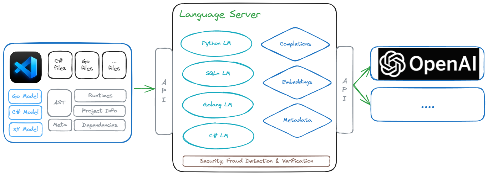

# Pandoc Markdown Documents

Easily create Word (docx) and PDF (pdf) documents from Markdown via [Pandocs](https://pandoc.org/installing.html) without the hassle of wrestling with fonts, styles etc. Because you know, this is not the 90s anymore.

This repository is ideal when your layout is simple and doesn't require tables or for technical documentation (Eg. with architecture diagrams with [Excalidraw](https://excalidraw.com/)) for example like this:

There's already recommended VSCode plugins you can use to expedite things.

## Setup

You'll need a few items for you to use this repository effectively:

* [Pandoc](https://pandoc.org/installing.html)
  You can install this with a package manager:

  Windows: 
    * `choco install pandoc`
    * `winget install --source winget --exact --id JohnMacFarlane.Pandoc`

  Macos: 
    * `brew install pandoc`
  
  Linux: See [installation instructions](https://pandoc.org/installing.html#linux)

## Converting

